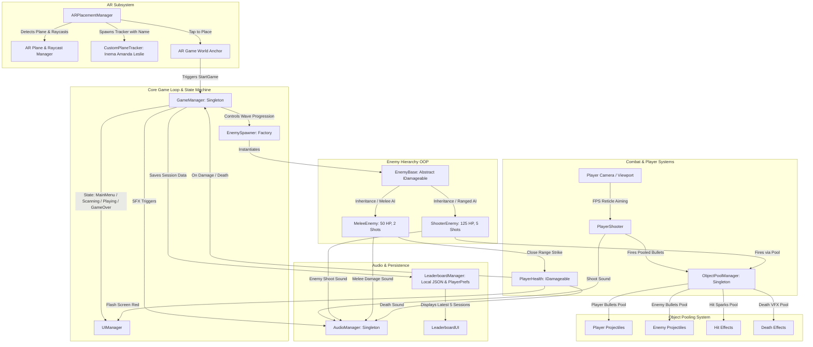

# Technical Documentation: AR Survival Shooter

**Student Name:** Inema Amanda Leslie  
**Project:** Mobile Augmented Reality (AR) Survival Shooter Game  
**Engine & SDK:** Unity 6 (6000.4.5f1) & Unity AR Foundation (ARCore / ARKit)  
**Target Platform:** Mobile AR (Android / iOS)  
**Perspective:** First-Person Shooter (FPS)  

---

## 1. Architecture Overview

The AR Survival Shooter is architected using a modular, decoupled, event-driven component structure designed specifically for high-performance mobile Augmented Reality. Because mobile AR tracking requires a consistent 60 frames per second without garbage collection (GC) stutter, the systems communicate via decoupled Observer events and utilize strict Object Pooling for all combat projectiles.

### System Architecture Diagram

---

## 2. Object-Oriented Programming (OOP) Structure

The codebase strictly adheres to the four fundamental pillars of OOP:

### A. Encapsulation
- All class fields across enemies, player, and managers are strictly `private` or `protected` to safeguard internal state from external tampering.
- State is accessed and exposed exclusively via clean public read-only properties:
  - `EnemyBase`: `CurrentHealth`, `MaxHealth`, `IsAlive`, `ScoreValue`, `Type`.
  - `PlayerHealth`: `CurrentHealth`, `MaxHealth`, `IsAlive`.
  - `GameManager`: `CurrentState`, `CurrentDifficulty`, `TimeRemaining`, `CurrentScore`.

### B. Abstraction
- **`IDamageable` Interface**: Defines the contract for any entity in the game world capable of sustaining damage (`TakeDamage(float amount, Vector3 hitPoint)`), allowing projectiles to inflict damage on both enemies and the player without needing concrete type references.
- **`IPooledObject` Interface**: Enforces uniform lifecycle management (`OnObjectSpawn()`, `ReturnToPool()`) across pooled entities (projectiles and visual effects).
- **`EnemyBase` Abstract Class**: Encapsulates common enemy logic (health management, player targeting, distance calculations, hit-flash coroutines, death events) while leaving specific combat behaviors abstract.

### C. Inheritance
A clean inheritance hierarchy is established for combat entities:
- `EnemyBase` (abstract) inherits from `MonoBehaviour` and implements `IDamageable`.
- `MeleeEnemy` inherits from `EnemyBase`.
- `ShooterEnemy` inherits from `EnemyBase`.

### D. Polymorphism
Concrete enemies override abstract and virtual methods to implement distinct behavioral archetypes:
- `HandleMovement()`: 
  - `MeleeEnemy`: Aggressively pursues the player directly, closing into close-range melee proximity with animated procedural walking bob.
  - `ShooterEnemy`: Advances toward the player but halts at a defined tactical combat distance (2.8m). If the player moves closer, it retreats to maintain standoff range while hovering and rotating its plasma core.
- `Attack()`:
  - `MeleeEnemy`: Deals direct proximity damage (20 HP) with an attack cooldown and triggers the melee crunch audio.
  - `ShooterEnemy`: Aims its dual muzzle cannons at the player and spawns an enemy projectile from `ObjectPoolManager` (15 HP) with the enemy shoot audio.

### Enemy Archetype Comparison Matrix

| Property | Melee Enemy | Shooter Enemy |
| :--- | :--- | :--- |
| **Visual Silhouette** | Angular biomechanical quadruped, crimson chassis, spiky twin scythe blades, glowing red eye visor | Spherical hover drone, tripod repulsor thrusters, pulsating cyan plasma reactor core, dual blaster barrels |
| **Combat Role** | Agile, swarming close-quarters runner | Ranged tactical support / artillery |
| **Max Health** | 50 HP (**2 Player Bullets**) | 125 HP (**5 Player Bullets**) |
| **Movement Speed** | 1.6 m/s (Fast) | 0.9 m/s (Methodical Standoff) |
| **Attack Range** | 1.2 meters (Melee proximity) | 3.5 meters (Ranged standoff) |
| **Attack Behavior** | Physical slash / bite on cooldown | Fires pooled plasma projectile at player |
| **Score Bounty** | 100 Points | 250 Points |

---

## 3. Design Patterns Used & Technical Justification

### 1. Object Pooling Pattern (Mandatory Requirement)
- **Why**: In Unity mobile AR, invoking `Instantiate()` and `Destroy()` during active combat causes immediate heap allocations, triggering Android's Garbage Collector. A garbage collection freeze of even 50ms causes ARCore/ARKit to lose camera feature tracking, causing visual jitter and motion sickness.
- **Implementation**:
  - `ObjectPoolManager` maintains pre-initialized `Queue<GameObject>` pools for:
    1. `PlayerProjectile` (30 pre-warmed instances)
    2. `EnemyProjectile` (30 pre-warmed instances)
    3. `HitEffect` (20 pre-warmed spark particle instances)
    4. `EnemyDeathEffect` (20 pre-warmed explosion instances)
  - When shooting, `SpawnFromPool()` dequeues an inactive instance, positions it, resets its trajectory and trail via `IPooledObject.OnObjectSpawn()`, and activates it.
  - Upon impact or lifetime expiration, `ReturnToPool()` resets velocities, clears trails, deactivates the object, and enqueues it back to the pool.
  - **Result**: Zero runtime `Instantiate` or `Destroy` calls during gameplay shooting.

### 2. Singleton Pattern
- **Why**: Centralizes critical subsystems that need global access across the scene without passing convoluted references through hierarchy components.
- **Implementation**:
  - `GameManager.Instance`: Controls round lifecycle, timers, and score.
  - `AudioManager.Instance`: Plays sound effects through dedicated channels.
  - `ObjectPoolManager.Instance`: Handles projectile acquisition and recycling.
  - `LeaderboardManager.Instance`: Manages session persistence.
  - `UIManager.Instance`: Coordinates screen states and telemetry.

### 3. State Pattern / Finite State Machine (FSM)
- **Why**: Enforces predictable game lifecycle progression and eliminates invalid input states.
- **Implementation**:
  - `GameState` Enum: `MainMenu` → `PlaneScanning` → `PlacementReady` → `Playing` → `GameOver` / `Leaderboard`.
  - UI panels and input modes activate/deactivate strictly in response to state transitions.

### 4. Factory / Spawner Pattern
- **Why**: Decouples enemy instantiation and wave progression from enemy AI behavior.
- **Implementation**:
  - `EnemySpawner` calculates random radial spawn positions anchored to the horizontal AR plane, selects between Melee and Shooter archetypes based on difficulty ratios, applies difficulty scaling multipliers, and tracks active instances for clean end-of-game cleanup (`WipeAllEnemies()`).

### 5. Observer Pattern (Event System)
- **Why**: Decouples core simulation systems from UI and Audio.
- **Implementation**:
  - `GameManager` and `PlayerHealth` expose standard C# events: `OnGameStateChanged`, `OnScoreChanged`, `OnTimerTick`, `OnHealthChanged`, `OnPlayerDamaged`, `OnGameOver`.
  - `UIManager` and `AudioManager` subscribe to these events without the simulation knowing about specific UI canvas elements or render components.

---

## 4. Custom AR Plane Tracker

Per the mandatory assignment specification:
1. **Student Name Display**: The custom plane visualizer visibly and prominently displays the student's full name: **Inema Amanda Leslie**.
2. **Textured Mesh Visualizer**: Replaces the default Unity plane visualizer with a custom cyber-grid disc featuring animated glowing borders and a 3D billboarded text badge (`INEMA AMANDA LESLIE - AR PLANE TRACKER`).
3. **Detection State**: The tracker appears strictly when a horizontal plane is detected by AR Foundation.
4. **Single-Instance Tap-to-Place**: 
   - Tapping on a detected plane anchors the virtual combat world at the hit pose.
   - A placement lock (`hasPlacedGameWorld = true`) ensures subsequent taps cannot spawn duplicate instances.
   - Upon placement, `ARPlacementManager` automatically disables further plane detection and hides all plane visualizers, optimizing battery life and AR tracking performance.
5. **Editor Simulator Fallback**: To facilitate rapid testing without requiring a mobile AR device, `ARPlacementManager` includes an Editor simulation raycast against a simulated floor plane.

---

## 5. Sound Implementation & Acoustic Design

The audio architecture utilizes a centralized `AudioManager` singleton featuring dedicated, shared `AudioSource` channels (`playerChannel`, `enemyChannel`, `uiChannel`, `ambientChannel`). This structure prevents audio clipping, permits independent channel volume balancing, and eliminates the common anti-pattern of attaching redundant `AudioSource` components to every enemy prefab.

### Mandatory Gameplay Sound Events

| Event | Trigger | Acoustic Design | Frequency / Waveform |
| :--- | :--- | :--- | :--- |
| **Player Shoot Sound** | `PlayerShooter.Shoot()` | Punchy laser blaster with fast downward pitch envelope | 880 Hz down to 180 Hz sine wave with square overtone and exponential decay envelope |
| **Player Death Sound** | `PlayerHealth.Die()` | Sub-bass impact and sweeping dark decay | 220 Hz down to 40 Hz pitch sweep layered with filtered noise |
| **Enemy Spawn Sound** | `EnemySpawner.SpawnRandomEnemy()` | Futuristic electronic warp chirp | 200 Hz up to 750 Hz cyber frequency rise with 30 Hz tremolo modulation |
| **Enemy Shoot Sound** | `ShooterEnemy.Attack()` | Sharp tactical plasma pulse | 650 Hz down to 220 Hz laser chirp |
| **Enemy Damage Sound** | `MeleeEnemy.Attack()` | Heavy melee impact crunch | 140 Hz down to 60 Hz low-end thud with white noise burst |

### Supplementary Audio Events
- **Enemy Death**: Low-end explosion rumble (80 Hz sub + noise).
- **UI Click**: Crisp metallic interface blip (1200 Hz micro-tone).
- **Game Over (Defeat)**: Descending dramatic minor chord sequence.
- **Game Over (Victory)**: Ascending C-Major triumphant fanfare.

*All audio files are procedurally synthesized at 44.1 kHz, 16-bit uncompressed PCM WAV format and saved directly in `Assets/Audio/`.*

---

## 6. UI & Local Leaderboard System

### UI System Hierarchy
1. **Start Menu**:
   - Game Title: `AR SURVIVAL SHOOTER`
   - Developer Credit: `DEVELOPER: INEMA AMANDA LESLIE`
   - Start Mission Button (activates AR plane scanning)
   - Leaderboard Button (opens local session history)
   - Difficulty Mode Selector (Normal, Hard, Nightmare)
2. **Plane Scanning / Placement HUD**:
   - Dynamic prompt guiding the player ("Move phone to detect horizontal plane...", "Plane detected! Tap screen to start combat").
3. **In-Game Combat HUD**:
   - Real-time Health bar & numeric readout (`HP: 100/100`)
   - Survival Countdown Timer (`SURVIVE: MM:SS`)
   - Score Display (`SCORE: X,XXX`)
   - Current Difficulty Badge
   - Center-screen Aiming Crosshair
   - Mobile Ergonomic On-Screen Fire Button
   - Dynamic Red Damage Vignette flash on player impact
4. **End Game Summary Modal**:
   - Outcome Banner (`SURVIVED! VICTORY` in green or `GAME OVER - DEFEATED` in red)
   - Final Score
   - Enemies Defeated Count
   - Total Time Survived
   - Restart Combat Button (restarts immediately on current plane)
   - Main Menu Button
5. **Local Leaderboard Modal**:
   - **Strict Requirement Compliance**: Displays strictly the latest 5 gameplay sessions.
   - Shows Rank #, Timestamp, Difficulty Mode, Outcome (WIN/LOSS), Final Score, Enemies Defeated, and Time Survived.
   - Back to Menu Button and Clear History Button.

### Leaderboard Persistence Architecture
- Data model: `SessionData` serialized via `JsonUtility`.
- File storage: Stored at `Application.persistentDataPath/leaderboard.json` with an automatic fallback sync to `PlayerPrefs`.
- Sessions are ordered chronologically (newest at index 0). `GetLatestSessions()` returns strictly `Mathf.Min(count, 5)`.

---

## 7. Bonus: Difficulty System

Three distinct difficulty presets alter gameplay variables dynamically:

| Difficulty Mode | Survival Time | Spawn Interval | Enemy Speed Mult | Enemy Health Mult | Shooter Spawn % |
| :--- | :--- | :--- | :--- | :--- | :--- |
| **Normal** | 60 Seconds | 3.5s | 1.0x | 1.0x | 30% |
| **Hard** | 75 Seconds | 2.45s | 1.25x | 1.2x | 45% |
| **Nightmare** | 90 Seconds | 1.55s | 1.5x | 1.4x | 50% |

---

## 8. Build & Setup Instructions

### One-Click Project Setup in Unity
1. Open the project folder in **Unity 6 (6000.4.5f1)**.
2. In the Unity top menu bar, select:  
   `Survival Shooter -> Setup Complete Game Scene`.
3. The automated editor tool will:
   - Generate all 9 procedural audio WAV assets in `Assets/Audio/`.
   - Build all 6 prefabs in `Assets/Prefabs/` (Melee, Shooter, Bullets, Custom Tracker with student name).
   - Construct and configure `Assets/Scenes/MainARSurvivalShooter.unity` with all subsystems wired.
   - Set the scene as Scene 0 in Build Settings.

### Mobile Build Settings (Android)
1. In `File -> Build Settings`, switch platform to **Android**.
2. In `Project Settings -> XR Plug-in Management`, check **Google ARCore**.
3. Under `Project Settings -> Player -> Android`:
   - Set **Minimum API Level** to `Android 7.0 'Nougat' (API Level 24)`.
   - Set **Scripting Backend** to `IL2CPP`.
   - Under Target Architectures, check `ARM64`.
4. Click **Build and Run** with your ARCore-compatible Android device connected via USB.
